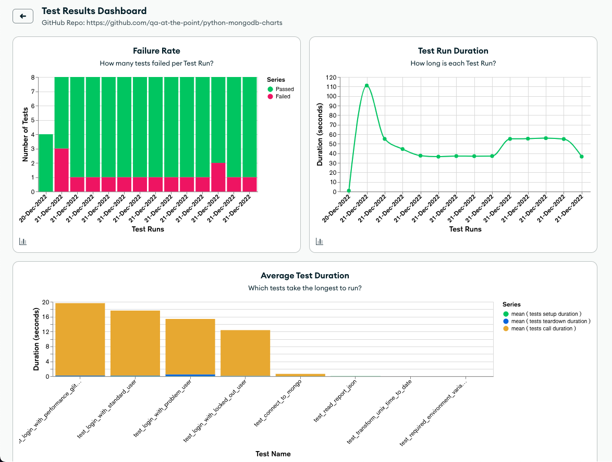

# Python + MongoDB + Charts


[🔗 Click this link to see the public version of this Dashboard! 🔗](https://charts.mongodb.com/charts-project-0-dizba/public/dashboards/73a21a88-8372-424f-8f2e-c3faef71a10a)

> 👋🏽 This is an example repo for working with MongoDB and **visualizing testing data** with MongoDB Charts.

Currently, there are examples of Unit and UI automated tests in this project, but more types and charts will come 😄

- [Setup](#setup)
  - [MongoDB](#mongodb)
  - [Gitpod](#gitpod)
  - [Local Machine Requirements](#machine-requirements)
  - [Browsers and Drivers](#browsers-and-drivers)
- [Run Tests](#run-tests)
- [Send Data to MongoDB](#send-data-to-mongodb)

> 💡 This project uses [Pylenium.io](https://docs.pylenium.io) for it's Web Automation.

## Setup

This section will help you set things up so you can work with this project.

> 💡 Using Gitpod is the recommended way to work with QA at the Point repos, but you can clone this locally as well

### MongoDB

> 👀 This repo assumes that you have created a free, [MongoDB Atlas](https://www.mongodb.com/cloud/atlas/register) account.

- This cloud-based account is where we will create databases, collections, and visual charts for our data!
- You can also install the free [MongoDB Compass](https://www.mongodb.com/products/compass) app for connecting and working with MongoDB locally.

Create a `.env` file at the Project Root and copy/paste your MongoDB connection string. You can use [example.env](/example.env) to see the formatting.

> Use [this guide](https://www.mongodb.com/docs/guides/atlas/connection-string/) to get the connection string

### Gitpod

With Gitpod, you just open a workspace and you're done 🎉 You can skip the rest of the setup, but make sure you have a free [MongoDB Atlas](https://www.mongodb.com/cloud/atlas/register) account!

### Machine Requirements

- 🐍 Python 3.8+
- 📦 Poetry as the package manager
- 💻 VS Code recommended

### Browsers and Drivers

Gitpod and Pylenium will automatically handle the driver binaries needed to work with Selenium.

- If in Gitpod, point pylenium.json's `local_path` to either `/usr/bin/chromedriver` (default) or `/usr/bin/geckodriver` since the browsers are _already_ installed
- Otherwise, `Pylenium` will handle downloading the correct driver binaries you need! Just make sure you have the actual browsers installed

## Run Tests

- If in Gitpod, open `Port 6080` if you'd like to see the tests run in "head" mode
- Otherwise, Pylenium runs tests in "head" mode by default

```bash
# Run all tests in the Terminal
poetry run poe test
```

You will see a `.report.json` file is created with the test results that we'll send to MongoDB in the next section!
Check out the [pytest-json-report](https://pypi.org/project/pytest-json-report/#format) plugin for more details on what you can do with this JSON report.

## Send Data to MongoDB

Once you've executed some tests, a `.report.json` is created at the Project Root. This report is what we preprocess and send to MongoDB!

```bash
# example
python main.py run report send ".report.json" unit functional
```
